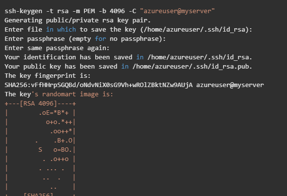
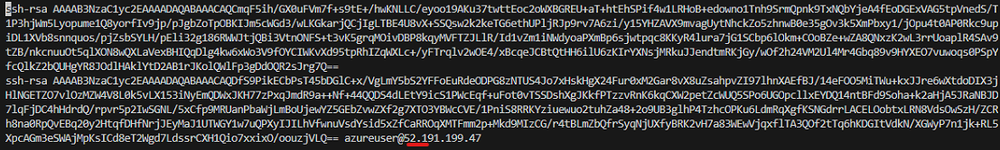
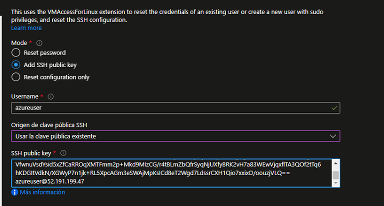
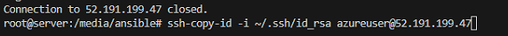
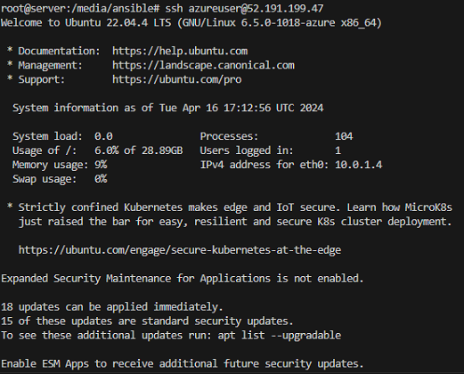

### **ANSIBLE**

---

Descargar el paquete previamente para poder realizar los playbooks.

---

Conexión hacia una VM linux en AZURE, creado por terraform:

* Crear la llave publica/privada en mi cliente ansible:

  
* Copiar el contenido de la llave y pegarlo en la VM de azure, para poder agregar una conexion ssh nueva:

  ```
  cat ~/.ssh/id_rsa.pub
  ```
  

  
* Copiar la llave y enviarlo a la VM linux en AZURE:

  
* Para comprobar que se haya copiado correctamente, se debe visualizar la llave en el siguiente path de la VM linux en AZURE:
* Verificamos la conexión:

  
*
